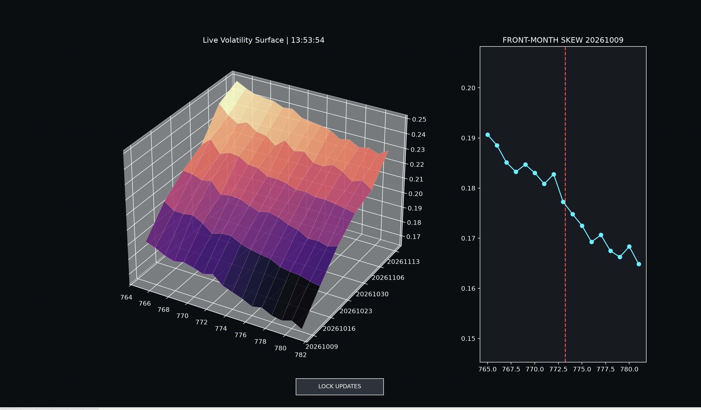

# Live Volatility Surface

A live implied volatility surface for the SPY options chain, streamed from Interactive Brokers (TWS) and drawn with matplotlib. The left panel is the surface across strike and expiry; the right panel is the skew of the nearest expiry, with spot marked in red.

## What it plots

The app pulls the six nearest expirations and every strike within ±2% of spot. It uses out-of-the-money options only (calls at or above spot, puts below), since those are the more liquid side of each strike.

Implied volatility is the $\sigma$ that makes the Black-Scholes price match the market price. For a call:

```math
C = S\,N(d_1) - K e^{-rT} N(d_2)
```

```math
d_1 = \frac{\ln(S/K) + (r + \sigma^2/2)\,T}{\sigma\sqrt{T}}, \qquad d_2 = d_1 - \sigma\sqrt{T}
```

where $S$ is spot, $K$ the strike, $T$ time to expiry in years, $r$ the risk-free rate, and $N$ the standard normal CDF. There is no closed form for $\sigma$, so it is solved numerically. This app does not do that itself: it reads the model IV that IB computes and sends with each option tick.

Black-Scholes assumes one constant $\sigma$, which would make the surface flat. It isn't: downside puts trade at higher IV than upside calls (the skew), and IV changes with time to expiry (the term structure). The surface shows both at once.

## Running it

```bash
pip install -r requirements.txt
python live-surface.py          # needs TWS running with the API enabled on port 7496
python live-surface.py --mock   # simulated feed, no TWS needed
```

The live path requests delayed market data, so it works without an API market data subscription. The `LOCK UPDATES` button freezes the plot so you can rotate it.

The mock feed generates a surface from a quadratic smile in log-moneyness $m = \ln(K/S)$, with a random-walking level $\sigma_0$ and a term that rises with expiry:

```math
\sigma(m, T) = \sigma_0 - 1.1\,m + 7\,m^2 + 0.04\sqrt{T / T_{1w}}
```

The screenshot above is from the mock feed.
